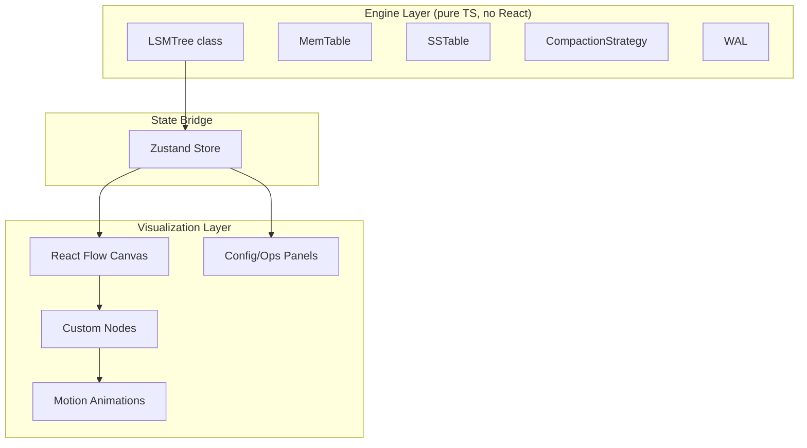

# LSM Tree Visualizer

## Tech Stack

- **React 19 + TypeScript** via **Vite 6**
- **@xyflow/react v12** (React Flow) -- draggable nodes, pan/zoom, custom nodes for SSTables/MemTable/WAL
- **Tailwind CSS v4 + shadcn/ui** -- modern UI components (sliders, cards, dialogs, buttons)
- **Zustand v5** -- lightweight state management bridging engine and UI
- **motion v12** (Framer Motion) -- animations for flush, compaction, and read path

## Architecture

The core principle: **separate the LSM engine (pure logic) from the visualization layer (React/Flow)**.




## Project Structure

```
src/
  engine/           # Pure TS -- zero React imports
    types.ts        # LSMConfig, KeyValue, SSTableMeta, etc.
    memtable.ts     # Sorted in-memory buffer (JS Map, sorted on iteration)
    sstable.ts      # SSTable model (key range, size, entries, level)
    compaction.ts   # Leveled + Size-Tiered strategies
    wal.ts          # WAL model (append-only log of ops)
    lsm-tree.ts     # Orchestrator: put/get/delete/flush/compact
  store/
    lsm-store.ts    # Zustand store wrapping engine, exposes actions + state
  hooks/
    use-flow-layout.ts  # Converts LSM state -> React Flow nodes + edges
  components/
    flow/
      MemTableNode.tsx   # Custom node: shows sorted KV pairs, fill level
      SSTNode.tsx        # Custom node: shows key range, size, entry count
      LevelGroupNode.tsx # Custom node: level container (L0, L1, ...)
      WALNode.tsx        # Custom node: write-ahead log entries
    panels/
      ConfigPanel.tsx    # LSM config sliders/inputs (draggable panel)
      OperationsPanel.tsx # Put/Get/Delete/Bulk controls
      StatsPanel.tsx     # Read/write amp, space amp, level stats
    StartScreen.tsx      # Landing: "Start Empty" vs "Start with Random Data"
    Visualizer.tsx       # Main canvas with React Flow + panels
  lib/
    utils.ts          # shadcn cn() helper
  App.tsx
  main.tsx
```

## LSM Engine Design (`src/engine/`)

### Key Types (`types.ts`)

```typescript
interface LSMConfig {
  memtableMaxSize: number;       // entries before flush (default: 8)
  levelMultiplier: number;       // size ratio between levels (default: 10)
  maxLevels: number;             // max depth (default: 5)
  l0CompactionTrigger: number;   // L0 SSTs before compaction (default: 4)
  compactionStrategy: 'leveled' | 'size-tiered';
}

interface KeyValue { key: string; value: string; timestamp: number; deleted?: boolean; }
interface SSTableMeta { id: string; level: number; entries: KeyValue[]; minKey: string; maxKey: string; size: number; }
```

### Core Engine (`lsm-tree.ts`)

- `put(key, value)` -- write to WAL, insert into MemTable, auto-flush when full
- `get(key)` -- search MemTable -> L0 (newest first) -> L1 -> ... -> Ln, return first match
- `delete(key)` -- tombstone write (put with `deleted: true`)
- `flush()` -- freeze MemTable, create SSTable at L0, trigger compaction check
- `compact()` -- run configured strategy, merge overlapping key ranges
- Each mutation returns an `LSMEvent` (what happened) so the UI can animate it

### Compaction Strategies (`compaction.ts`)

- **Leveled** (RocksDB-style): pick SST from Ln, merge with overlapping SSTs in Ln+1, write new SSTs to Ln+1
- **Size-Tiered** (Cassandra-style): when a level has enough similarly-sized SSTs, merge them into one larger SST at next level

## Visualization Design

### React Flow Canvas (`Visualizer.tsx`)

- Top row: WAL node (left) + MemTable node (right)
- Below: Level groups (L0, L1, L2...) as horizontal bands, each containing SSTable nodes
- Edges: animated during flush (MemTable -> L0) and compaction (Ln -> Ln+1)
- Built-in pan, zoom, minimap, controls

### Custom Nodes


| Node               | Visual                                                                    |
| ------------------ | ------------------------------------------------------------------------- |
| **MemTableNode**   | Bar showing fill level, sorted KV list, glows when near-full              |
| **SSTNode**        | Card showing key range `[min..max]`, entry count, file size               |
| **LevelGroupNode** | Labeled horizontal band (`Level 0`, `Level 1`...) containing SST children |
| **WALNode**        | Scrollable log of recent write operations                                 |


### Layout Hook (`use-flow-layout.ts`)

Converts `LSMState` from Zustand into positioned React Flow `Node[]` and `Edge[]`. Recalculates positions when state changes (add/remove SSTables, levels grow).

### Panels (draggable floating panels over the canvas)

- **ConfigPanel**: sliders for memtable size, level multiplier, max levels, L0 trigger, compaction strategy dropdown. Changes apply on next operation (or reset).
- **OperationsPanel**: text inputs for key/value + Put/Get/Delete buttons. "Bulk Insert" for N random records. "Step" button to manually trigger flush/compaction.
- **StatsPanel**: write amplification, read amplification, space amplification, per-level SST count, total entries.

### Start Screen (`StartScreen.tsx`)

Clean landing page with:

- Title + brief explanation of LSM trees
- Two cards: "Start from Scratch" (empty) and "Start with Sample Data" (pre-populates ~30 random KV pairs triggering a few flushes)
- Optional: config preset before starting

### Animations

- **Flush**: MemTable entries animate flowing down into a new L0 SSTable (motion layout animation)
- **Compaction**: involved SSTables pulse/highlight, then merge animation into new SSTs
- **Read path**: highlight each level searched in sequence (MemTable -> L0 -> L1...) with a scanning effect
- **Write**: key-value entry animates into WAL then MemTable

## Styling

- Dark mode default (fits the developer-tool aesthetic), light mode toggle via shadcn `colorMode`
- Monospace font for keys/values
- Subtle gradients on level bands to distinguish depth
- Color coding: MemTable (blue), L0 (amber/orange), L1+ (gradient from green to purple by depth)

## Setup Steps

1. Scaffold with `pnpm create vite@latest . --template react-ts`
2. Install deps: `@xyflow/react`, `zustand`, `motion`, `tailwindcss`, `@tailwindcss/vite`
3. Init shadcn/ui, add components: `button`, `card`, `slider`, `input`, `select`, `badge`, `dialog`, `switch`, `tooltip`
4. Build engine layer (pure TS, unit-testable)
5. Build Zustand store
6. Build custom React Flow nodes
7. Build layout hook
8. Build panels
9. Build start screen + main app shell
10. Polish animations and styling

